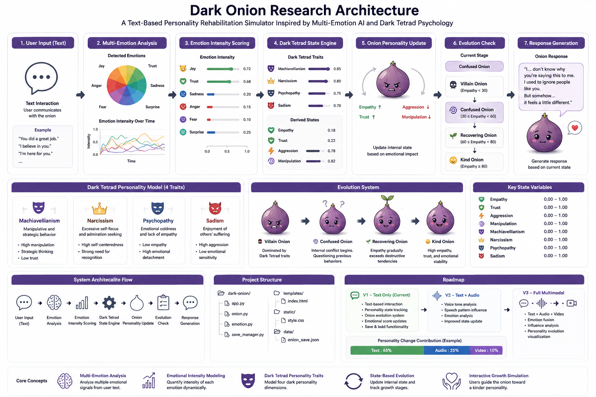

# Dark Onion Test



**A Text-Based Personality Rehabilitation Simulator Inspired by Multi-Emotion AI and Dark Tetrad Psychology**

Dark Onion is an experimental AI simulation project that models the rehabilitation of personality traits through continuous emotional interaction.

The project combines:

* Multi-Emotion Analysis
* Emotional Intensity Modeling
* Dark Tetrad Personality Traits
* State-Based Character Evolution
* Interactive Personality Growth Simulation

Instead of generating responses from a fixed personality, Dark Onion allows users to gradually transform a personality-driven onion character through positive communication and emotional influence.

---

# Project Goal

Can a highly manipulative, narcissistic, callous, or aggressive character become more empathetic through continuous positive interaction?

Dark Onion explores this question through a simulated personality evolution framework.

Users select a Dark Tetrad Onion and interact with it over time.

The onion's internal state changes based on emotional input and progresses through multiple growth stages.

---

# Core Concepts

### Multi-Emotion Analysis

User text is analyzed for emotional signals.

Examples:

* Trust
* Joy
* Sadness
* Anger

Each interaction contributes to the onion's emotional development.

---

### Dark Tetrad Personality Model

The simulator is based on four personality dimensions:

| Trait            | Description                                 |
| ---------------- | ------------------------------------------- |
| Machiavellianism | Manipulative and strategic behavior         |
| Narcissism       | Excessive self-focus and admiration seeking |
| Psychopathy      | Emotional coldness and lack of empathy      |
| Sadism           | Enjoyment of others' suffering              |

Each onion begins with different personality characteristics.

---

# Available Onion Types

## Machiavellian Onion

* High manipulation
* Strategic thinking
* Low trust

## Narcissistic Onion

* High self-centeredness
* Strong need for recognition

## Psychopathic Onion

* Low empathy
* High emotional detachment

## Sadistic Onion

* High aggression
* Low emotional sensitivity

---

# Evolution System

The onion evolves through emotional growth.

```text
🥀 Villain Onion
        ↓
🌀 Confused Onion
        ↓
🌱 Recovering Onion
        ↓
😊 Kind Onion
```

### Villain Onion

Dominated by Dark Tetrad traits.

### Confused Onion

Internal conflict begins.

The onion starts questioning previous behaviors.

### Recovering Onion

Empathy gradually exceeds destructive tendencies.

### Kind Onion

High empathy, trust, and emotional stability.

---

# System Architecture

```text
User Input (Text)
        ↓
Emotion Analysis
        ↓
Emotion Intensity Scoring
        ↓
Dark Tetrad State Engine
        ↓
Onion Personality Update
        ↓
Evolution Check
        ↓
Response Generation
```

---

# Project Structure

```text
dark-onion/
├── app.py
├── onion.py
├── emotion.py
├── save_manager.py
├── templates/
│   └── index.html
├── static/
│   └── style.css
└── data/
    └── onion_save.json
```

---

# Current Version

### V1 — Text Only

Features:

* Text-based interaction
* Personality state tracking
* Onion evolution system
* Emotional score updates
* Save & load functionality

---

# Future Roadmap

### V2 — Text + Audio

```text
Text
Audio
 ↓
Emotion Analysis
 ↓
Onion State Update
```

Voice tone and speech patterns will influence personality growth.

---

### V3 — Full Multimodal Onion

```text
Text
Audio
Video
 ↓
Emotion Fusion
 ↓
Influence Analysis
 ↓
Personality Evolution
```

The system will visualize how each modality contributes to personality change.

Example:

```text
Personality Change Contribution

Text   : 65%
Audio  : 25%
Video  : 10%
```

---

# Research Motivation

Dark Onion is inspired by:

* Multi-Emotion and Intensity-Driven Response Generation
* Dark Tetrad Personality Research
* Emotional AI Systems
* Personality-Aware Dialogue Agents
* Interactive Character Simulation

The project investigates how emotional interactions influence personality states over time and how AI agents can simulate long-term behavioral change.

---

# License

MIT License

---

# Author

Kim Jihwan

AI Engineer / Game AI Research Enthusiast

Exploring the intersection of:

* Artificial Intelligence
* Personality Psychology
* Emotional Computing
* Interactive Simulation Systems
